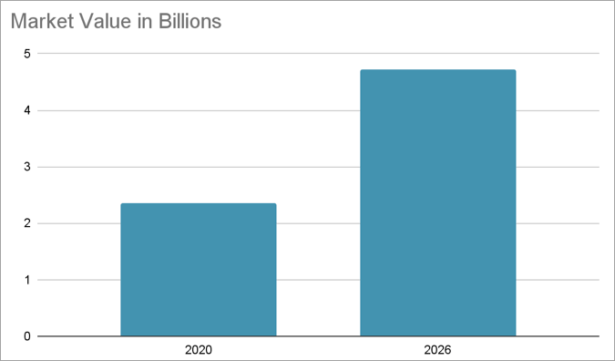

# Экономический анализ

## Объем рынка в целом

A study by Mordor Intelligence says that the market for task management software is expected to grow at a CAGR of 12.32% and reach $4.72 billion by 2026 from $2.35 billion in 2020.
(согласно [www.mordorintelligence.com](https://www.mordorintelligence.com/industry-reports/task-management-software-market#:~:text=The%20task%20management%20software%20market,12.32%25%20during%20the%20forecast%20period.))  

| Параметр                  | Оценка             |
|---------------------------|--------------------|
| Объем рынка               | 4.72 млрд. $ в год |
| Возможная доля рынка      | 0.1%               |
| Достижимый годовой оборот | 5 млн. $ в год     |
