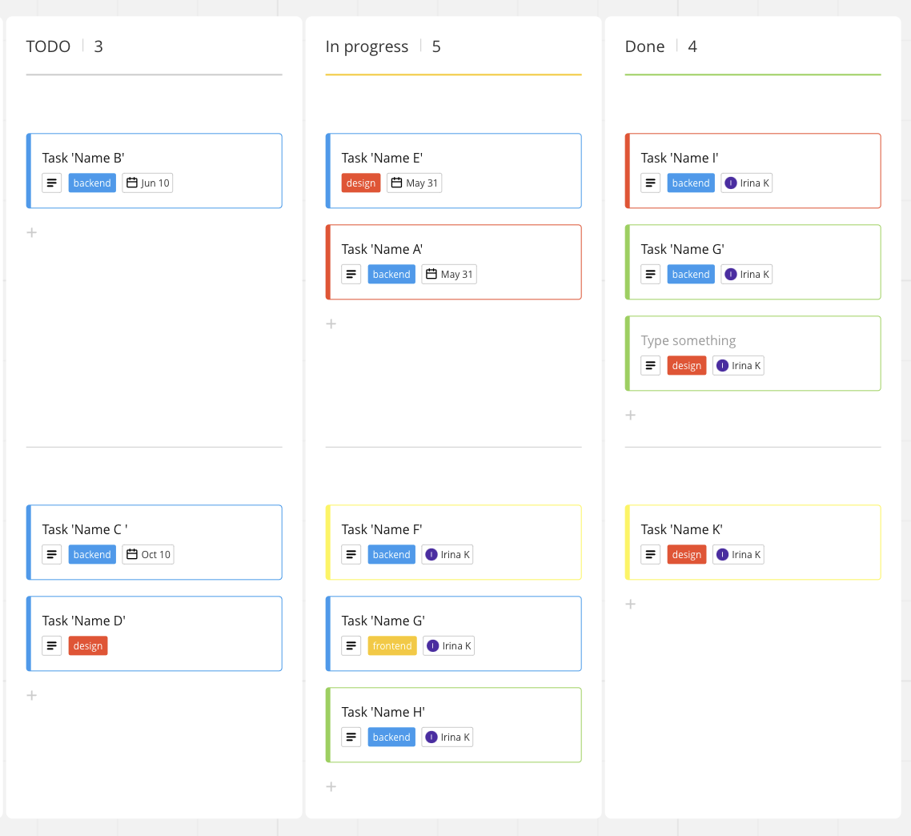

- [Example of interface](#Example-of-interface)
- [Intellij IDEA Project structure](#Intellij-IDEA-Project-structure)
- [Logging](#Logging)

### Example of interface



----------

### Intellij IDEA Project structure


---

### Logging

run docker: `_deploy/docker-compose-fbos.yml`

run gradle: `app-ktor -> application -> run`


http://localhost:5601


run: `acceptance/rest/v1-project.rest`

One of logs from dashboard:
```json
{
  "_index": "app-logs-2023.07.16",
  "_id": "htDKYIkBfJvdHi4cJp_R",
  "_version": 1,
  "_score": null,
  "_source": {
    "@timestamp": "2023-07-16T22:20:07.990Z",
    "flb-key": "app.logs",
    "@version": "1",
    "component": "task-tracker",
    "container-id": "MacBook-Pro-Irina.local",
    "message": "CREATE response is sent",
    "logger_name": "createProject",
    "thread_name": "DefaultDispatcher-worker-17",
    "caller_class_name": "me.neversleeps.logging.jvm.LogWrapperLogback",
    "caller_method_name": "log",
    "caller_file_name": "LogWrapperLogback.kt",
    "caller_line_number": 35,
    "HOSTNAME": "MacBook-Pro-Irina.local",
    "data": {
      "messageTime": "2023-07-16T22:20:07.990784Z",
      "logId": "createProject-response",
      "source": "task-tracker",
      "project": {
        "requestId": "12345",
        "operation": null,
        "requestProject": {
          "id": null,
          "title": "some title",
          "description": "some description",
          "createdBy": null
        },
        "requestFilter": null,
        "responseProject": {
          "id": "03e13b55-b5b2-484d-a08b-b18aeb087c88",
          "title": "some title",
          "description": "some description",
          "createdBy": null
        },
        "responseProjects": null
      },
      "errors": []
    },
    "tags": [
      "DEV"
    ],
    "caller": "Caller+0\t at me.neversleeps.logging.jvm.LogWrapperLogback.log(LogWrapperLogback.kt:35)\nCaller+1\t at me.neversleeps.logging.jvm.LogWrapperLogback.log(LogWrapperLogback.kt:71)\nCaller+2\t at me.neversleeps.logging.common.ILogWrapper$DefaultImpls.info(ILogWrapper.kt:33)\nCaller+3\t at me.neversleeps.logging.jvm.LogWrapperLogback.info(LogWrapperLogback.kt:13)\nCaller+4\t at me.neversleeps.logging.common.ILogWrapper$DefaultImpls.info$default(ILogWrapper.kt:28)\n",
    "level": "INFO",
    "marker": "DEV",
    "logger": "createProject",
    "thread": "DefaultDispatcher-worker-17"
  },
  "fields": {
    "@timestamp": [
      "2023-07-16T22:20:07.990Z"
    ]
  },
  "sort": [
    1689546007990
  ]
}
```

Visualize -> Create new visualization -> Area -> select `app-logs-*`


Index pattern can be created here:  
Stack management -> Index patters

Created index-pattern:


Dashboard by`data.logId` filter:


Visualization with `data.logId` filter:
