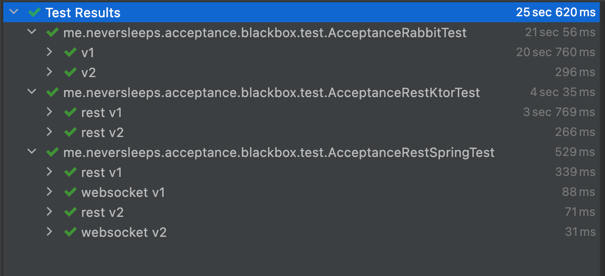

## Приемочные тесты

### Целевое решение

C использованием `docker-compose` запускаются приложения 
(`spring`, `ktor`, `websocket`, `rabbitmq`, `kafka`), поднимается база данных и
тестируются обе версии API путем отправки соответствующих 
запросов и проверки ответов.

Проект зависит только от транспортных моделей (чтобы было удобно отправлять запросы и проверять ответы).

### Roadmap

1. Оснастка и проверка на Wiremock 
2. Только `spring` и без БД
3. Добавляем `Ktor`
4. Добавляем `Rabbit` 
5. Добавляем `Kafka`
6. При появлении работы с БД
   * раскомментируем и убираем все // TODO
   * в каждое из приложений выше добавляем БД
   * добавляем очистку БД

### Организация проекта

* `docker` - обертки над соответствующими docker-compose
* `fixture` - оснастка
  * `docker` - оснастка для docker
  * `client` - клиенты для разных протоколов
* `test` - сами тесты
  * `AccRestTest` - запуск http/rest тестов для spring и ktor
  * `testVx` - тесты для соотв. версии АПИ
  * `action.vx` - примитивные действия для тестов и вспомогательные matcher-ы

### Поведение тестов

* Тесты разбиты на отдельные классы (наследники `BaseFunSpec`, который основан на `FunSpec`).
* Перед запуском тестов в классе поднимается соответствующий `docker-compose`
* После завершения тестов в классе `docker-compose` завершается
* Перед каждым тестом выполняется очистка базы данных, чтобы сделать тесты независимыми друг от друга

