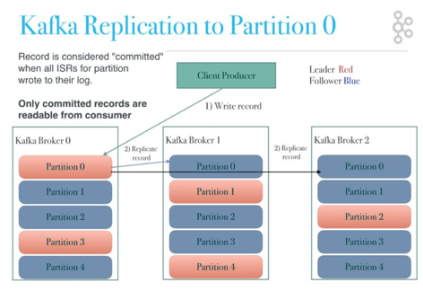
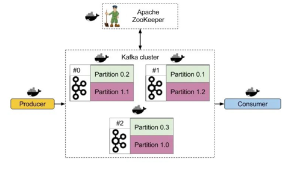
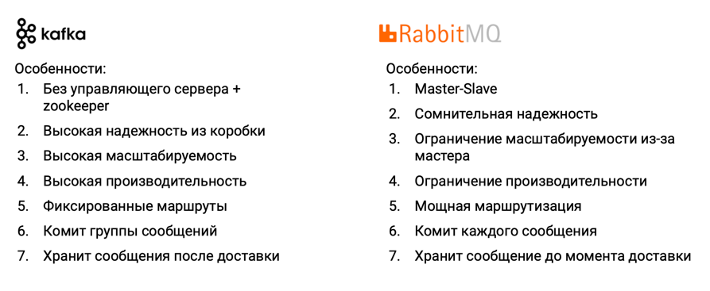

**Kafka** – это система, реализующая распределенный реплицируемый лог сообщений.  

- Распределенный – лог (топик) не целиком хранится на одной машине, а разбит на несколько секций (партиций), которые лежат на разных машинах
- Реплицируемый – логи хранится в нескольких копиях, на случай отказов оборудования
- Лог – это упорядоченная последовательность сообщений

### Устройство Kafka

**Partition**:
- Позволяет доставлять сообщения параллельно
- Обеспечивает масштабирование
- Может иметь реплики
- Резервируется в файловой системе
- Используется алгоритм последовательной записи
- Запись всегда происходит в конец партиции, чтение возможно с любого места (двигая offset)

**Consumer**:
- извлекает сообщения из партиций
- может быть подключен к нескольким партициям
- группируются по GroupID. Consumer c одним GroupID для кафки воспринимается как один логический получатель. Эта механика обеспечивается тем, что сообщение читается только одним из Consumer'ов, односящихся к одной группе. То есть к партиции может быть подключен только один Consumer из Consumer-группы 
- Для конкуретного чтения топика 5 Consumer'ами, нужно не менее 5 партиций

**Consumer Groups**:
- Каждое сообщение получает один Consumer из группы
- Разные группы получают каждое сообщение
- Consumer может читать из нескольких партиций
- Каждая партиция связана только с одним Consumer'ром из группы
- Для чтения топика 5 Consumer'ами одной группы, нужно не менее 5 партиций
- Если Consumer'ов больше, чем партиций – лишние не будут ничего получать

При добавлении нового consumer-а в группу, или удалении существующего, или если один из Consumer'ов падает,  
consumer group переходит в состояние перебалансировки, во время которого ни один из Consumer'ов не читает сообщения из топиков.
В процедуре перебалансировки участвуют:
- один из брокеров на стороне кафки
- один из consumer'ов. Он может управлять распределением привязки партиций к consumer'ам, по умолчанию это происходит примерно поровну, но возможно и перенастроить.

**Дефолтный алгоритм партиционирования**: Определяется хэш (md5) от ключа, от этого хэша берется остаток от деления на число партиций. Это значение и будет номером партиции.

У сообщения в kafka может быть ключ (key). Если есть ключ, то тогда партиционирование происходит таким образом, чтобы сообщения с одним ключом попадали в одну партицию. Кафка гарантирует порядок сообщений только в рамках одной партиции.

**Replication** - Обеспечивает гарантированную доставку сообщений в условиях сбоев.  
Партиции:  
- Leader – основная  
- In-Sync Replica – реплика, синхронизованная с лидером.

Авторы Kafka советуют
- фактор репликации 1, если вы ок, что данные могут быть потеряны
- фактор репликации 3, если хотите, чтобы данные остались в сохранности.

Разные брокеры могут являться лидерами для разных партиций. Таким образом достигается распараллеливание

**Кластеризация**:
- Распределенная архитектура без управляющего сервера благодаря ZooKeeper
- На разных узлах как партиции, так и реплики партиций
- Клиент может подключаться к любому узлу / к нескольким узлам / через zookeeper
- Клиент знает всю топологию кластера
  

###  Kafka vs RabbitMQ

[little kafka guide](https://cdn.otus.ru/media/public/79/bc/202302_OK_M3L6__Kafka-34322-79bcb4.pdf)

