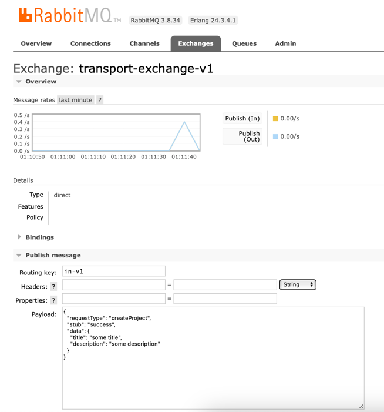
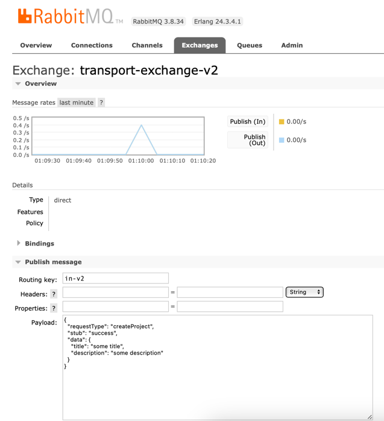

Simple application without any frameworks, just with `com.rabbitmq:amqp-client` library.

http://localhost:15672


```
INFO me.neversleeps.rabbitmq.processor.RabbitDirectProcessorV1 -- Publishing ProjectCreateResponse(responseType=null, requestId=, resultStatus=error, errors=null, project=ProjectResponseObject(title=some title, description=some description, createdBy=8098d197-a58f-4ae4-b602-8db6a146fb17, id=03e13b55-b5b2-484d-a08b-b18aeb087c88, permissions=[read, update, delete])) to transport-exchange-v1 exchange for keyOut out-v1
```



```
INFO me.neversleeps.rabbitmq.processor.RabbitDirectProcessorV2 -- Publishing ProjectCreateResponse(responseType=createProject, requestId=, resultStatus=error, errors=null, project=ProjectResponseObject(title=some title, description=some description, createdBy=8098d197-a58f-4ae4-b602-8db6a146fb17, id=03e13b55-b5b2-484d-a08b-b18aeb087c88, permissions=[read, update, delete])) to transport-exchange-v2 exchange for keyOut out-v2
```