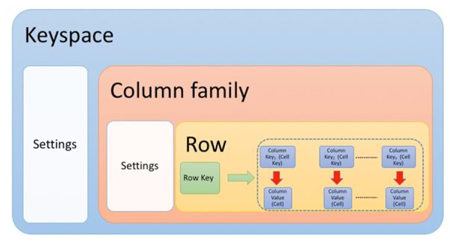

## Cassandra

- Cassandra - колоночная распределенная БД с высокой масштабируемостью и надежностью.  
- Надежность за счет репликации, масштабируемость из-за отсутствия мастера.
- Данные распределены по партиционным ключам, кластерные ключи на одном узле.
- При запросах нужно делать много мелких асинхронных запросов на запись, no batches.

Особенность:
- Колоночная база данных
- Распределенная база данных
- В том числе гео-распределение по датацентрам
- Простое масштабирование
- Неограниченное количество данных
- Производительность пропорциональна числу узлов
- Беспрецедентная живучесть (не применяется бэкап)
- Нет реляционной модели (CQL, не SQL)
- Нет операции OR в WHERE
- Все запросы асинхронные
- Батчи применяются только для атомарных операций

### Coхранение

Logging data in the commit log Writing data to the memtable Flushing data from the memtable Storing data on disk in SSTables:  

### Чтение
Check the memtable.  
Check row cache, if enabled.  
Check Bloom filter.  
Check partition key cache, if enabled.  
Go directly to the compression offset map if a partition key is found in the partition key cache, or check the partition summary if not.  
If the partition summary is checked, then the partition index is accessed.  
Locate the data on disk using the compression offset map.  
Fetch the data from the SSTable on disk.  

