## Yandex.cloud simple manual

- [Loading jar file to bucket](#Loading-jar-file-to-bucket)
- [Using of loaded jar for function](#Using-of-loaded-jar-for-function)
- [API Gateway](#API-Gateway)
- [Testing](#Testing)

### Loading jar file to bucket

Bucket list:

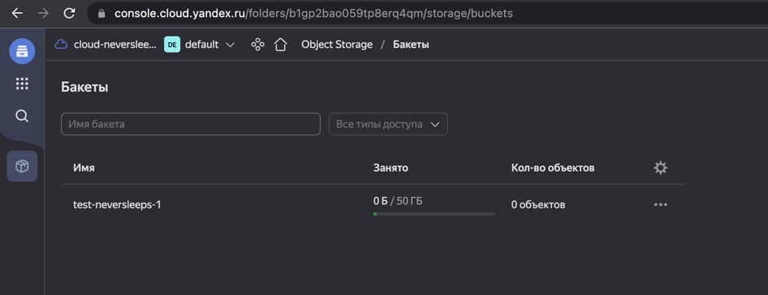

New folder into the bucket:

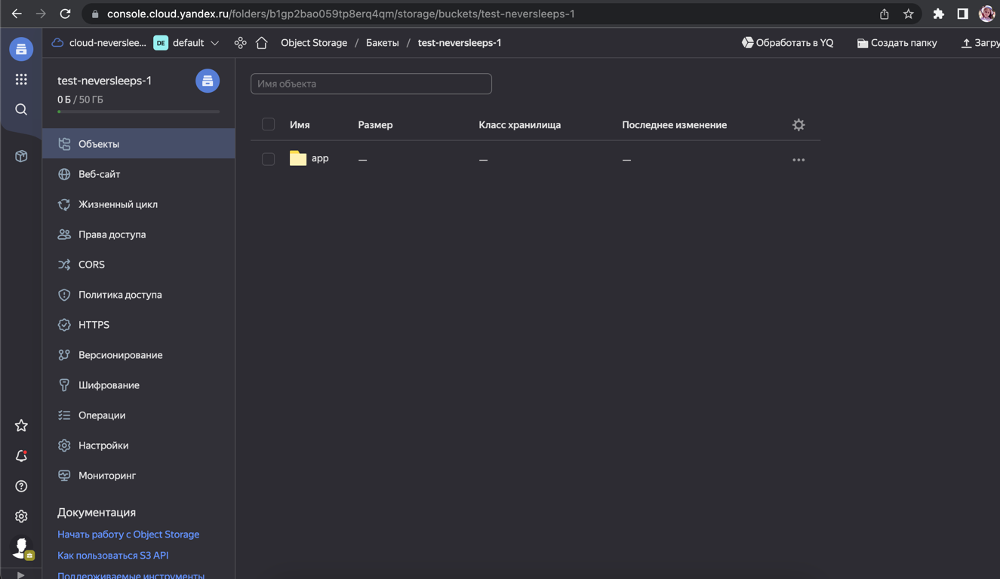

Opened empty folder:

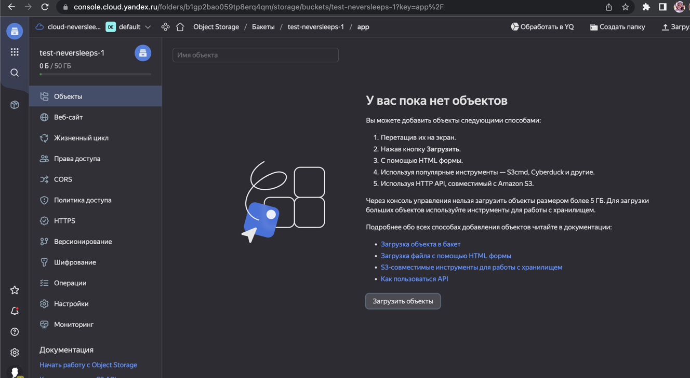

Generate fat jar by `gradle shadowJar`.  
Result will be there: `app-serverless/build/libs/app-serverless-1.0-SNAPSHOT-all.jar`

File loading window:

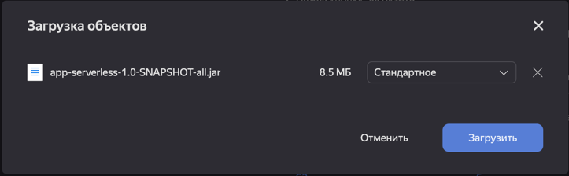

Loaded file:

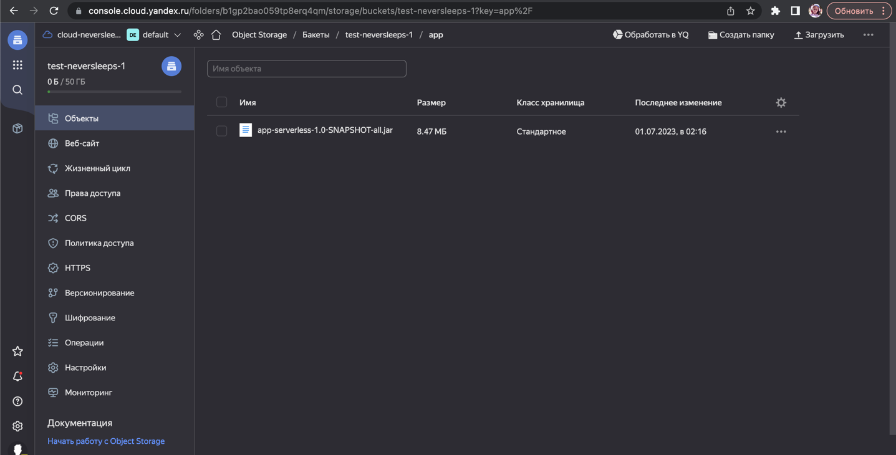

### Using of loaded jar for function

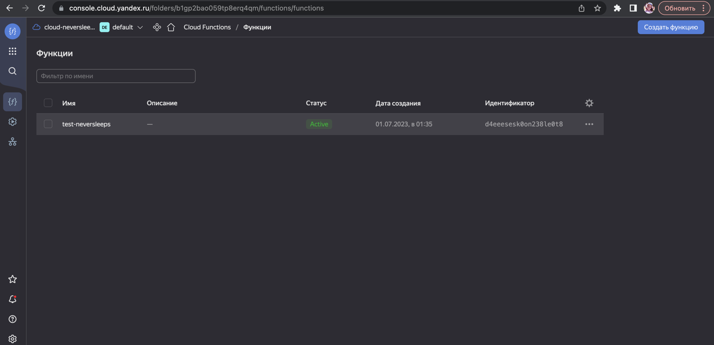

Function settings:

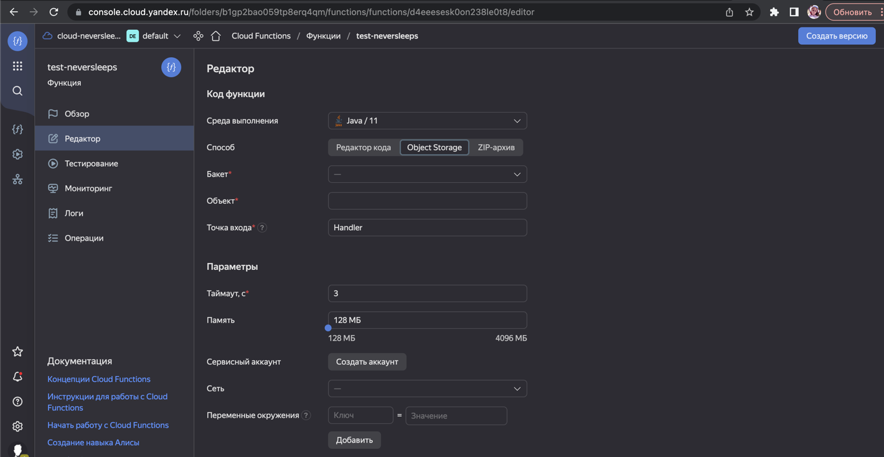

Fill in fields:

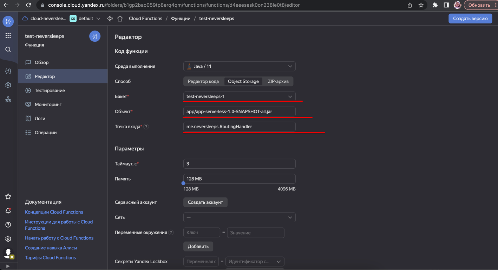

Updated function:


I had some problems with version (for 17 yandex cloud could not find my classes, so I rebuilt my project for 11 version and loaded it again into bucket):
1. Set 11 jvm version in `task-tracker/build.gradle.kts`:
```kotlin
subprojects {
    tasks.withType<KotlinJvmCompile> {
        kotlinOptions.jvmTarget = "11"
    }
}
```
2. Set `11.0.16` sdk version for project (project structure).
3. Exclude spring module (`// include("app-spring")` here: task-tracker/settings.gradle.kts)
4. `clean build` for all project, then `gradle shadowJar` for app-serverless module

Result:

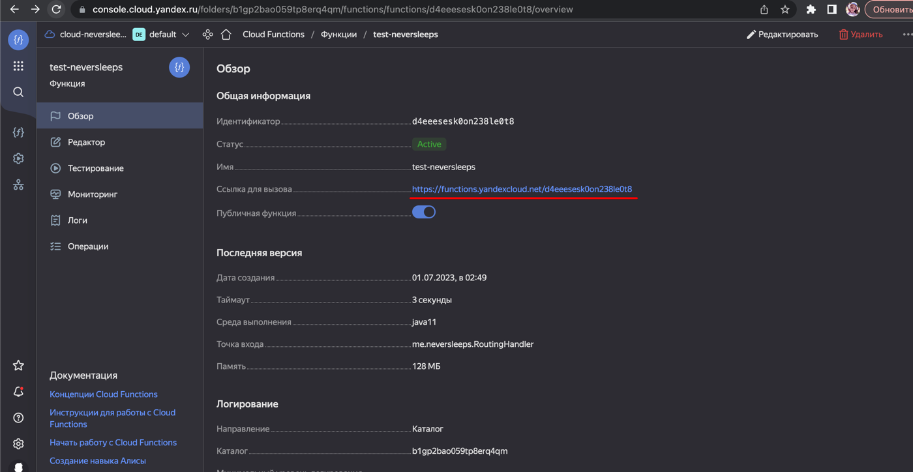

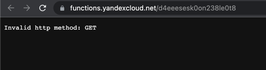

### API Gateway

API Gateway settings:
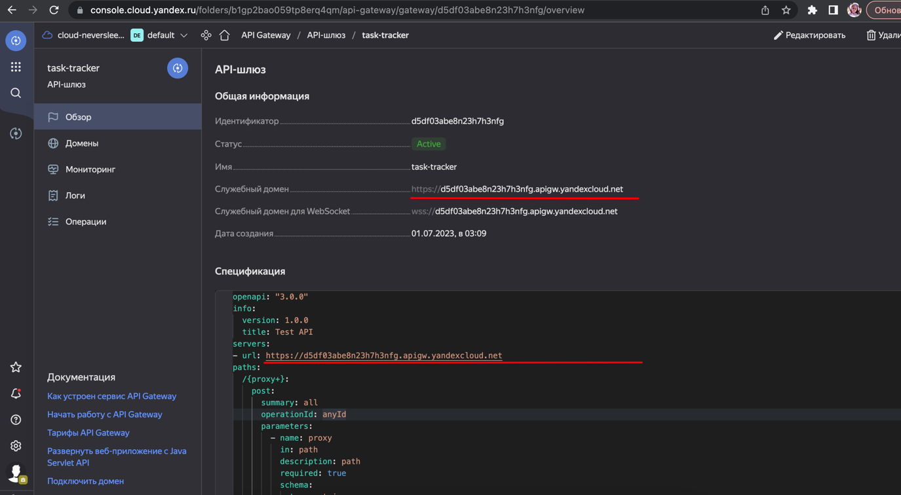

Text of specification:
```yaml
openapi: "3.0.0"
info:
  version: 1.0.0
  title: Test API
servers:
- url: https://d5df03abe8n23h7h3nfg.apigw.yandexcloud.net
paths:
  /{proxy+}:
    post:
      summary: all
      operationId: anyId
      parameters:
        - name: proxy
          in: path
          description: path
          required: true
          schema:
            type: string
      x-yc-apigateway-integration:
        type: cloud_functions
        function_id: d4eeesesk0on238le0t8
        tag: "$latest"
```

### Testing

Example of postman request:


curl:
```
curl --location --request POST 'https://d5df03abe8n23h7h3nfg.apigw.yandexcloud.net/v1/project/read' \
--header 'Content-Type: application/json' \
--data-raw '{
    "requestType": "readProject",
    "requestId": "123"
}'
```

Profit!