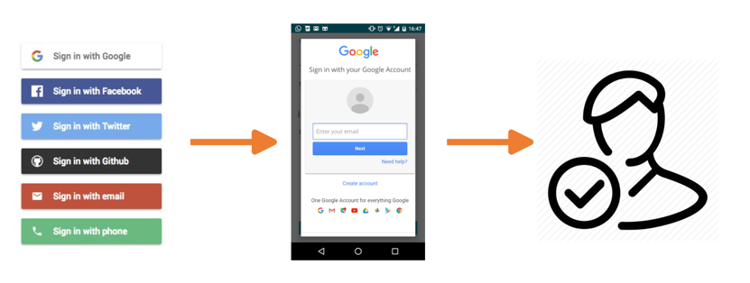
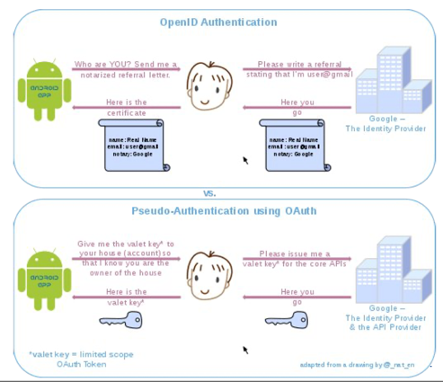
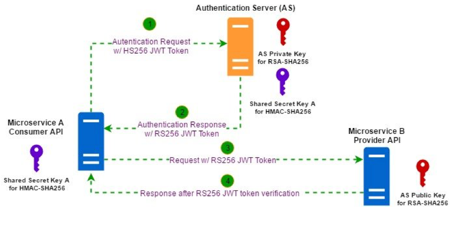
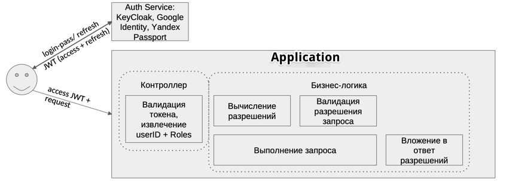
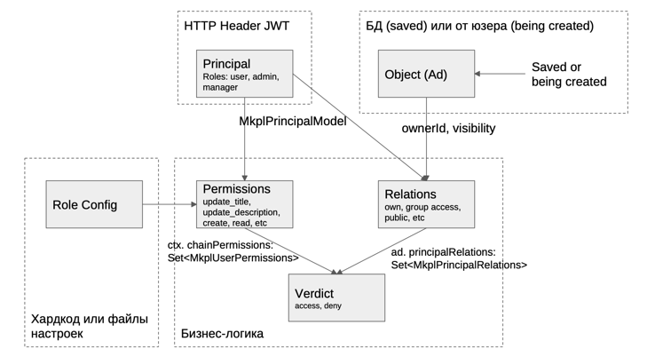

**Идентификация** – процесс распознавания пользователя по его идентификатору.  
**Аутентификация** – проверка подлинности.  
**Авторизация** – проверка наличия прав.

##### Федеративная аутентификация:

##### OAuth2:
1. User пытается получить доступ к Resource Server (RS)
2. RS перенаправляет User на Authentication Server (AS)
3. Пользователь вводит login/pass, получает токен (ключ с ограничениями)
4. User идет с токеном по обратному адресу на RS
5. Получает доступ к ресурсам

##### OpenID Connect
1. User пытается получить доступ к Resource Server (RS)
2. RS перенаправляет User на Authentication Server (AS)
3. Пользователь вводит login/pass, получает XRI подписанный AS документ
4. User идет с XRI по обратному адресу на RS
5. Получает доступ к ресурсам

##### Сравнение OAuth2 и OpenId Connect: 

### Алгоритм для микросервисной архитектуры:

1. Сервис А хочет сходить в сервис B
2. Сервис А идет в AS, идентифицируется и получает access-токен и refresh-токен
3. Сервис А добавляет access-токен в заголовок запроса к сервису B
4. Сервис B проверяет токен (токен подписан) и отвечает
5. Когда access-токен устаревает (несколько минут или несколько десятков минут), сервис А получает новый access токен по имеющемуся refresh-токену

### Архитектура аутентификации

### Архитектура авторизации

