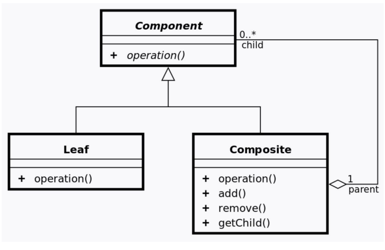
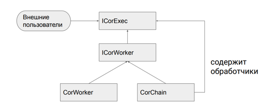
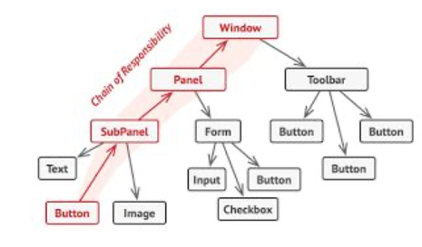

Это управляющий шаблон, а не реализующий. Все реализации
конкретных функций должны быть вынесены в функциональные классы
 
Типичный состав цепочки:
- Инициализация
- Обработка стабов
- Валидация
- Работа с БД и др. репозиториями
- Работа с машиной состояний
- Работа с ML
- Подготовка ответа
- Завершение
- Длā каждого источника событий своя цепочка
- Цепочки могут объединяться

#### Устройство цепочки

- worker - одинарный обработчик
- chain - цепочки обработчиков, в т.ч. и вложенных chain

Классический шаблон разработки CoR:
Каждый worker выполняет вызов следующего worker'а

Текущая реализация:

Шаблон разработки CoR:
1. Context – DTO для хранения всех возможных состояний текущего бизнес-процесса
2. Pipeline/Procesor/Chain – управляет всем бизнес-процессом и запускает обработчики (маршрутизация)
3. Operation/Handler/Worker – выполняет один блок работ
   
На картинке:
1. Контекст - это продукт
2. Обработчик – это оператор
3. Процессор – лента конвейера

