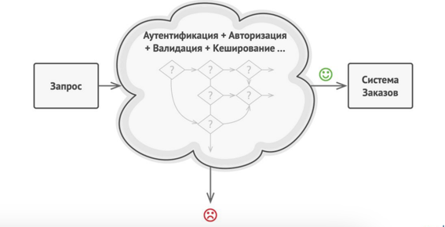

### Chain of Responsibility Design Pattern Library
#### original library: https://github.com/crowdproj/kotlin-cor

Such a representation of the business logics has the following advantages.

- It is optimized for human readability. So, any developer will easily find the required operation.
- It is extremely agile and allows easily change the business process without substantial refactoring.
- Provides "code first" approach that is better suit the needs of developers.

#### CoR vs BPMS

BPMS engines provide a "declaration first" approach where business logics is developed in a visual designer. This is may be very convenient for analysts, architects or manager but brings few disadvantages to developers. The main problem is current engines use a schema: Visual Editor -> xml spec -> code.

- This means that developers do not control the code. Any change by an analyst to BPM schema may break your application and bring a headache to the developer.
- Autogenerated XML file is also severe and its manual change is problematic.
- This prevents parallel development of the business processes since git-conflicts cannot be easily resolved.

- This CoR library doesn't compete with BPM as is. But it allows developers to control the code themselves.

